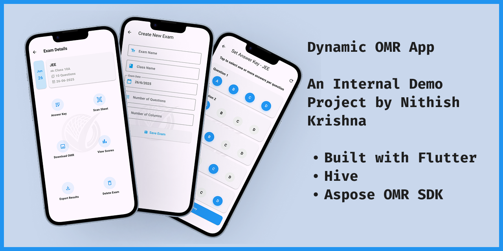

<!-- PROJECT HEADER -->
 

  <!-- Optional placeholder icon (replace later with a neutral app icon if you wish) -->

  <h3 align="center">Dynamic OMR App</h3>
  

  📱 Flutter | ☁️ Aspose OMR SDK | 💾 Hive Storage | 🔍 Exam Evaluation System
     
    🌐 <a href="https://nk.xo.je" target="_blank"><b>nk.xo.je</b></a>

  

    A Flutter-based <b>OMR Examination Management App</b> for Teachers to Create, Scan, and Evaluate Exams Digitally.
     
     
    <a href="https://www.figma.com/proto/I88m9x7bwREVdZ7QT6DlXa/OMRApp?node-id=1-2038&t=ScUKmRk">🎥 View Demo (Figma Prototype)</a>
    ·
    <a href="https://github.com/Nithish-Krishna/dynamic-omr-app/issues">Report Issue</a>
     
    (Opens in Figma – no sign-in required)
  

---

## 📘 About the Project

The **Dynamic OMR App** is a Flutter-based mobile application built to streamline exam evaluation for teachers.  
It allows educators to **create OMR sheets, scan student responses, and generate detailed performance reports** — all from a single, intuitive interface.

---

> ⚠️ **Project Disclaimer**
> 
> - 🧩 Developed as part of an internal company project at **Vidwath Innovative Solutions Pvt. Ltd.**  
> - ❌ Not deployed to production due to API pricing constraints.  
> - 🖋️ Screenshots may include the **Vidwath** watermark or branding.  
> - 🔒 Source code remains private and is showcased here **for demonstration and portfolio purposes only**.

### 🎯 Core Purpose
Teachers often spend hours evaluating answer sheets manually.  
This app automates that process using **Aspose.OMR Cloud SDK**, allowing teachers to:
- Create custom OMR sheets for exams  
- Set answer keys for objective tests  
- Scan filled sheets via camera  
- Instantly generate and export results in CSV or PDF  

---

## 🛠️ Built With

* **Framework:** Flutter  
* **Language:** Dart  
* **Local Storage:** Hive (for caching & offline persistence)  
* **SDK:** Aspose.OMR Cloud SDK for Dart  
* **IDE:** Android Studio  
* **Architecture:** REST API–driven, cloud OMR recognition  

---

## ⚙️ Project Flow

Below is a simplified walkthrough of how the app works, along with key interface mockups:

---

### 🏠 1. Exams Screen (Home)
Displays a list of all created exams.  
Teachers can add new exams or access existing ones.

  

---

### 📝 2. Create Exam
Teachers input essential exam details such as:
- Exam name  
- Class name  
- Exam date  
- Number of questions & columns  

The app uses an API call to automatically generate a corresponding OMR template.

  

---

### 🔑 3. Answer Key Setup
Teachers define correct answers (A/B/C/D) for all questions through an interactive interface.  
Supports multiple-correct options for complex question patterns.

  

---

### 📷 4. Scan OMR Sheets
Teachers enter a student’s name and scan their OMR sheet using the device camera.  
Aspose API detects bubbled responses, matches them with the answer key, and stores results securely via Hive.

  

---

### 📊 5. View Scores
Displays all students’ names, total marks, percentages, and question-wise accuracy.  
Includes **copy**, **CSV/PDF export**, and **share** options for quick result dissemination.

  

---

### 📈 6. Student Analysis
A detailed breakdown per student showing:
- Question number  
- Selected vs. Correct answer  
- Auto-evaluated result (✅/❌)  
- Editable answers for teacher corrections or disputes  

  

---

### 🧾 7. Edit Answers  
Teachers can review and modify individual student responses if scanning errors or disputes occur.  
Each question entry shows:  
- Question number  
- Student’s marked option  
- Correct answer  
- Result (✅ / ❌)  
- Editable input for manual correction  

  

---

### 📤 8. Export & Manage  
Teachers can:  
- Download printable OMR sheet templates  
- Export class-level reports (CSV or PDF)  
- Delete outdated exams or results

---

## ☁️ APIs Used

| Function | Description |
|-----------|-------------|
| **Generate OMR Template** | Creates dynamic OMR sheets (.png and .omr files) based on teacher inputs such as exam name, number of questions, and columns. |
| **Poll Generation Result** | Periodically checks the Aspose API for the completion status of the OMR template generation task. |
| **Recognize Filled OMR Sheet** | Sends scanned OMR images to the Aspose Recognize API to detect marked bubbles and return encoded response data. |
| **Poll Recognition Result** | Repeatedly polls the recognition endpoint until the OMR scan results are ready. |
| **Save Recognition / Generation Files** | Decodes, processes, and saves generated or recognized files (OMR, PNG, CSV) to local storage using Hive. |

All API interactions are performed securely through the **Aspose.OMR Cloud SDK for Dart**, with final results stored locally for offline access and report generation.

---

## 💡 Challenges & Learnings

**Challenges faced:**
- Managing API latency while scanning multiple sheets in real-time.  
- Handling edge detection and skewed scans gracefully.  
- Optimizing local caching with Hive for seamless navigation.  
- Designing a smooth UX flow for teachers with minimal tech experience.

**Learnings:**
- Deeper understanding of SDK integration and REST APIs in Flutter.  
- Building modular UI architecture for scalable state management.  
- Balancing between cloud-based scanning and local data handling.  

---

## 🚧 Future Roadmap

- [ ] Offline scanning support using on-device ML models  
- [ ] Student portal for individual performance tracking  
- [ ] Admin dashboard for multi-class management  
- [ ] Improved OMR template customization  

---

## 👨‍💻 Developer

**👤 Nithish Krishna K S**  
Junior Software Developer @ Vidwath  
📍 Mysuru, Karnataka  
📧 [nithish.krishna0101@gmail.com](mailto:nithish.krishna0101@gmail.com)  
🌐 [nk.xo.je](https://nk.xo.je)  
🔗 [LinkedIn](https://linkedin.com/in/nithishkrishna01)

---

## 🗒️ Notes

> 🔒 *This project was developed as part of a company initiative.  
Source code is private and shared here only for portfolio demonstration.*  

> 🧠 *All API keys, configurations, and assets have been omitted for confidentiality.*

---

(<a href="#readme-top">back to top</a>)

